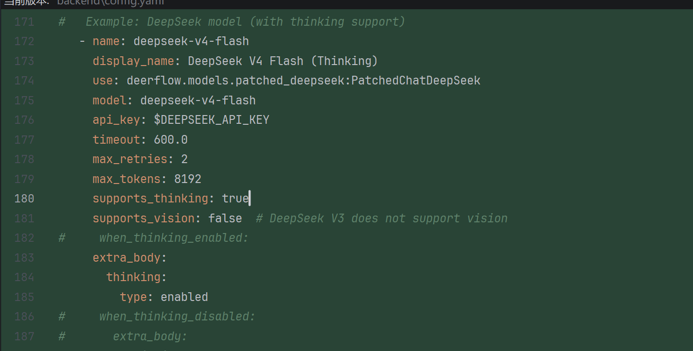
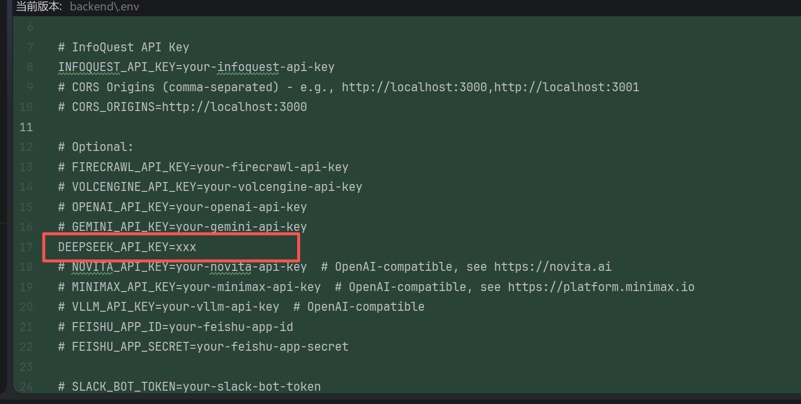

## 版本说明这是基于deerflow2.0 版本的无需docker版本

### 步骤

#### 1. 启动nginx
```commandline
cd nginx_1p30

./nginx.exe -c conf/nginx.local.conf   
```

#### 2. 启动后端
```commandline
cd backend
先配置.env和config.yaml文件

uv run --no-sync uvicorn app.gateway.app:app --host 0.0.0.0 --port 8001
```
config.yaml 需要配置一个模型


.env 文件需要配置上对应模型的api-key



#### 3. 启动langgraph
```commandline
cd backend

langgraph dev --port 2024
```

#### 4. 启动前端
```commandline
cd frontend

pnpm install 

pnpm dev
```